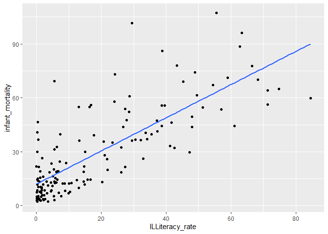

Week 1 Homework, Unit 2
================
Lemi Daba
2/14/2021

``` r
# Some basic set-up
library(tidyverse)
```

    ## -- Attaching packages -------------------------------------------- tidyverse 1.3.0 --

    ## v ggplot2 3.3.2     v purrr   0.3.4
    ## v tibble  3.0.3     v dplyr   1.0.1
    ## v tidyr   1.1.1     v stringr 1.4.0
    ## v readr   1.3.1     v forcats 0.5.0

    ## -- Conflicts ----------------------------------------------- tidyverse_conflicts() --
    ## x dplyr::filter() masks stats::filter()
    ## x dplyr::lag()    masks stats::lag()

``` r
devt <- read_csv("wb_dev_ind.csv")
```

    ## Parsed with column specification:
    ## cols(
    ##   countrycode = col_character(),
    ##   countryname = col_character(),
    ##   gdp_per_capita = col_double(),
    ##   literacy_female = col_double(),
    ##   literacy_male = col_double(),
    ##   literacy_all = col_double(),
    ##   infant_mortality = col_double()
    ## )

Question 1
----------

What is the Mean of **GDP per capita**? What is the standard deviation
of GDP per capita? (Please round to the nearest whole number. For
instance, 1235 would be accepted if the correct answer 1234.56)

### Answer

``` r
devt
```

    ## # A tibble: 214 x 7
    ##    countrycode countryname gdp_per_capita literacy_female literacy_male
    ##    <chr>       <chr>                <dbl>           <dbl>         <dbl>
    ##  1 ABW         Aruba               19913.            96.7          96.9
    ##  2 ADO         Andorra             35628.            NA            NA  
    ##  3 AFG         Afghanistan           415.            17.6          45.4
    ##  4 AGO         Angola               2738.            59.1          82.5
    ##  5 ALB         Albania              4091.            95.7          98.0
    ##  6 ARE         United Ara~         25141.            91.5          89.5
    ##  7 ARG         Argentina            6195.            98.0          97.9
    ##  8 ARM         Armenia              2310.            99.5          99.7
    ##  9 ASM         American S~            NA             NA            NA  
    ## 10 ATG         Antigua an~         11481.            99.4          98.4
    ## # ... with 204 more rows, and 2 more variables: literacy_all <dbl>,
    ## #   infant_mortality <dbl>

``` r
summary(devt)
```

    ##  countrycode        countryname        gdp_per_capita     literacy_female 
    ##  Length:214         Length:214         Min.   :   155.2   Min.   :  8.94  
    ##  Class :character   Class :character   1st Qu.:  1124.4   1st Qu.: 63.40  
    ##  Mode  :character   Mode  :character   Median :  4109.6   Median : 91.37  
    ##                                        Mean   : 12967.2   Mean   : 78.54  
    ##                                        3rd Qu.: 15122.3   3rd Qu.: 97.33  
    ##                                        Max.   :158802.5   Max.   :100.00  
    ##                                        NA's   :15         NA's   :60      
    ##  literacy_male     literacy_all    infant_mortality 
    ##  Min.   : 23.25   Min.   : 15.46   Min.   :  1.600  
    ##  1st Qu.: 78.33   1st Qu.: 71.34   1st Qu.:  7.075  
    ##  Median : 93.43   Median : 92.16   Median : 15.250  
    ##  Mean   : 85.92   Mean   : 82.15   Mean   : 25.611  
    ##  3rd Qu.: 98.43   3rd Qu.: 97.91   3rd Qu.: 39.650  
    ##  Max.   :100.00   Max.   :100.00   Max.   :107.200  
    ##  NA's   :60       NA's   :60       NA's   :22

``` r
devt %>% summarise(
  mean_gdpPc = mean(gdp_per_capita, na.rm = TRUE) %>% round(),
  sd_gdpPc = sd(gdp_per_capita, na.rm = TRUE) %>% round()
)
```

    ## # A tibble: 1 x 2
    ##   mean_gdpPc sd_gdpPc
    ##        <dbl>    <dbl>
    ## 1      12967    20761

Question 2
----------

What is the mean **illiteracy rate** across all countries? What is the
standard deviation? (Please round to the nearest hundredth. For
instance, 67.89 would be accepted if the correct answer is 67.8912)

### Answer

``` r
devt %>%
  mutate(ILliteracy_all = 100 - literacy_all) %>%
  summarise(
    mean_ILLit = mean(ILliteracy_all, na.rm = TRUE) %>% round(2),
    sd_ILLit = sd(ILliteracy_all, na.rm = TRUE) %>% round(2)
  )
```

    ## # A tibble: 1 x 2
    ##   mean_ILLit sd_ILLit
    ##        <dbl>    <dbl>
    ## 1       17.8     20.3

Question 3
----------

What is the mean **infant mortality rate** across all countries? What is
the standard deviation? (Please round to the nearest hundredth. For
instance, 67.89 would be accepted if the correct answer is 67.8912)

### Answer

``` r
devt %>%
  summarise(
    mean_INF_mortal = mean(infant_mortality, na.rm = TRUE) %>% round(2),
    sd_INF_mortal = sd(infant_mortality, na.rm = TRUE) %>% round(2)
  )
```

    ## # A tibble: 1 x 2
    ##   mean_INF_mortal sd_INF_mortal
    ##             <dbl>         <dbl>
    ## 1            25.6          23.9

Question 4
----------

What is the mean male illiteracy rate? What is the mean female
illiteracy rate? (Please round to the nearest hundredth. For instance,
67.89 would be accepted if the correct answer is 67.8912)

### Answer

``` r
devt %>%
  mutate(
    ILLit_male = 100 - literacy_male,
    ILLit_female = 100 - literacy_female
  ) %>%
  summarise(
    mean_ILLit_male = mean(ILLit_male, na.rm = TRUE) %>% round(2),
    mean_ILLit_female = mean(ILLit_female, na.rm = TRUE) %>% round(2)
  )
```

    ## # A tibble: 1 x 2
    ##   mean_ILLit_male mean_ILLit_female
    ##             <dbl>             <dbl>
    ## 1            14.1              21.5

|                                                                                                        |
|--------------------------------------------------------------------------------------------------------|
| For questions 5 to 8, restrict your dataset to countries for which we have GDP per capita information. |

``` r
devt_gdp <- devt %>%
  filter(!is.na(gdp_per_capita))
```

Question 5
----------

What are the mean, minimum, and maximum **illiteracy rate** among the 50
richest countries? (Please round to the nearest hundredth. For instance,
67.89 would be accepted if the correct answer is 67.8912)

### Answer

``` r
devt_gdp %>%
  arrange(desc(gdp_per_capita)) %>%
  filter(row_number() <= 50) %>%
  mutate(ILLiteracy_all = 100 - literacy_all) %>%
  summarise(
    mean_ILLit_rich = mean(ILLiteracy_all, na.rm = TRUE) %>% round(2),
    min_ILLit_rich = min(ILLiteracy_all, na.rm = TRUE) %>% round(2),
    max_ILLit_rich = max(ILLiteracy_all, na.rm = TRUE) %>% round(2)
  )
```

    ## # A tibble: 1 x 3
    ##   mean_ILLit_rich min_ILLit_rich max_ILLit_rich
    ##             <dbl>          <dbl>          <dbl>
    ## 1            4.19            0.3           9.97

Question 6
----------

What are the mean, minimum, and maximum **illiteracy rate** among the 50
poorest countries? (Please round to the nearest hundredth. For instance,
67.89 would be accepted if the correct answer is 67.8912)

### Answer

``` r
devt_gdp %>%
  arrange(gdp_per_capita) %>%
  filter(row_number() <= 50) %>%
  mutate(ILLiteracy_all = 100 - literacy_all) %>%
  summarise(
    mean_ILLit_poor = mean(ILLiteracy_all, na.rm = TRUE) %>% round(2),
    min_ILLit_poor = min(ILLiteracy_all, na.rm = TRUE) %>% round(2),
    max_ILLit_poor = max(ILLiteracy_all, na.rm = TRUE) %>% round(2)
  )
```

    ## # A tibble: 1 x 3
    ##   mean_ILLit_poor min_ILLit_poor max_ILLit_poor
    ##             <dbl>          <dbl>          <dbl>
    ## 1            40.6           0.26           84.5

Question 7
----------

What are the mean, minimum, and maximum **infant mortality rate** among
the 50 richest countries? (Please round to the nearest hundredth. For
instance, 67.89 would be accepted if the correct answer is 67.8912)

### Answer

``` r
devt_gdp %>%
  arrange(desc(gdp_per_capita)) %>%
  filter(row_number() <= 50) %>%
  summarise(
    mean_INFmortal_rich = mean(infant_mortality, na.rm = TRUE) %>% round(2),
    min_INFmortal_rich = min(infant_mortality, na.rm = TRUE) %>% round(2),
    max_INFmortal_rich = max(infant_mortality, na.rm = TRUE) %>% round(2)
  )
```

    ## # A tibble: 1 x 3
    ##   mean_INFmortal_rich min_INFmortal_rich max_INFmortal_rich
    ##                 <dbl>              <dbl>              <dbl>
    ## 1                4.18                1.6               13.4

Question 8
----------

What are the mean, minimum, and maximum infant mortality rate among the
50 poorest countries? (Please round to the nearest hundredth. For
instance, 67.89 would be accepted if the correct answer is 67.8912)

### Answer

``` r
devt_gdp %>%
  arrange(gdp_per_capita) %>%
  filter(row_number() <= 50) %>%
  summarise(
    mean_INFmortal_poor = mean(infant_mortality, na.rm = TRUE) %>% round(2),
    min_INFmortal_poor = min(infant_mortality, na.rm = TRUE) %>% round(2),
    max_INFmortal_poor = max(infant_mortality, na.rm = TRUE) %>% round(2)
  )
```

    ## # A tibble: 1 x 3
    ##   mean_INFmortal_poor min_INFmortal_poor max_INFmortal_poor
    ##                 <dbl>              <dbl>              <dbl>
    ## 1                54.1                 19               107.

------------------------------------------------------------------------

For questions 9-15, return to using the original (unrestricted) data
set.

------------------------------------------------------------------------

Question 9
----------

What is the **median** GDP per capita? (Please round to the nearest
whole number.)

### Answer

``` r
devt %>%
  summarise(median_gdpPc = median(gdp_per_capita, na.rm = TRUE) %>% round())
```

    ## # A tibble: 1 x 1
    ##   median_gdpPc
    ##          <dbl>
    ## 1         4110

Question 10
-----------

Regress the infant mortality rate on per capita GDP, and then answer
questions 10-12.

### Answer

``` r
lm(infant_mortality ~ gdp_per_capita, data = devt) %>% summary()
```

    ## 
    ## Call:
    ## lm(formula = infant_mortality ~ gdp_per_capita, data = devt)
    ## 
    ## Residuals:
    ##     Min      1Q  Median      3Q     Max 
    ## -24.883 -15.757  -6.932   9.823  76.032 
    ## 
    ## Coefficients:
    ##                  Estimate Std. Error t value Pr(>|t|)    
    ## (Intercept)    31.4035085  1.7852358  17.591   <2e-16 ***
    ## gdp_per_capita -0.0005740  0.0000826  -6.949    6e-11 ***
    ## ---
    ## Signif. codes:  0 '***' 0.001 '**' 0.01 '*' 0.05 '.' 0.1 ' ' 1
    ## 
    ## Residual standard error: 20.98 on 186 degrees of freedom
    ##   (26 observations deleted due to missingness)
    ## Multiple R-squared:  0.2061, Adjusted R-squared:  0.2018 
    ## F-statistic: 48.29 on 1 and 186 DF,  p-value: 6.004e-11

Question 13
-----------

Regress the illiteracy rate on GDP per capita. Is the coefficient on per
capita GDP significantly different from zero at the 5% level?

### Answer

``` r
lm(I(100 - literacy_all) ~ gdp_per_capita, data = devt) %>% summary()
```

    ## 
    ## Call:
    ## lm(formula = I(100 - literacy_all) ~ gdp_per_capita, data = devt)
    ## 
    ## Residuals:
    ##     Min      1Q  Median      3Q     Max 
    ## -23.140 -14.684  -4.794   8.864  60.970 
    ## 
    ## Coefficients:
    ##                  Estimate Std. Error t value Pr(>|t|)    
    ## (Intercept)    23.8344669  1.8448598  12.919  < 2e-16 ***
    ## gdp_per_capita -0.0008979  0.0001663  -5.399 2.61e-07 ***
    ## ---
    ## Signif. codes:  0 '***' 0.001 '**' 0.01 '*' 0.05 '.' 0.1 ' ' 1
    ## 
    ## Residual standard error: 18.7 on 148 degrees of freedom
    ##   (64 observations deleted due to missingness)
    ## Multiple R-squared:  0.1645, Adjusted R-squared:  0.1589 
    ## F-statistic: 29.15 on 1 and 148 DF,  p-value: 2.611e-07

Question 14
-----------

Regress the infant mortality rate on the illiteracy rate. Graph a
scatter plot of the data as well as the regression line.

### Answer

``` r
lm(infant_mortality ~ I(100 - literacy_all), data = devt) %>% summary()
```

    ## 
    ## Call:
    ## lm(formula = infant_mortality ~ I(100 - literacy_all), data = devt)
    ## 
    ## Residuals:
    ##     Min      1Q  Median      3Q     Max 
    ## -30.128  -8.968  -3.652   4.817  62.473 
    ## 
    ## Coefficients:
    ##                       Estimate Std. Error t value Pr(>|t|)    
    ## (Intercept)           11.96077    1.64708   7.262 2.06e-11 ***
    ## I(100 - literacy_all)  0.92340    0.06012  15.360  < 2e-16 ***
    ## ---
    ## Signif. codes:  0 '***' 0.001 '**' 0.01 '*' 0.05 '.' 0.1 ' ' 1
    ## 
    ## Residual standard error: 14.95 on 147 degrees of freedom
    ##   (65 observations deleted due to missingness)
    ## Multiple R-squared:  0.6161, Adjusted R-squared:  0.6135 
    ## F-statistic: 235.9 on 1 and 147 DF,  p-value: < 2.2e-16

``` r
devt %>%
  mutate(ILLiteracy_rate = 100 - literacy_all) %>%
  ggplot(aes(ILLiteracy_rate, infant_mortality)) +
  geom_point() +
  geom_smooth(se = FALSE, method = "lm")
```

    ## `geom_smooth()` using formula 'y ~ x'

    ## Warning: Removed 65 rows containing non-finite values (stat_smooth).

    ## Warning: Removed 65 rows containing missing values (geom_point).

<!-- -->
